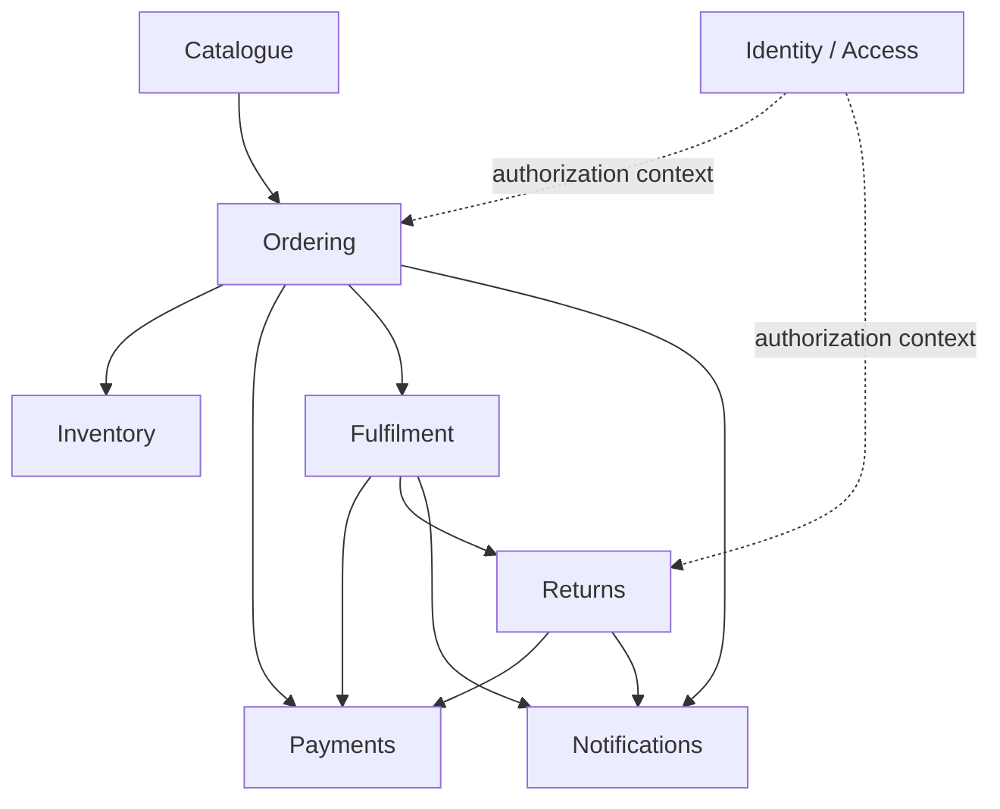

# Context Map

## Ownership summary

| Context | Owns |
|---|---|
| Catalogue | Product identity, current sellable information and catalogue snapshots used by ordering |
| Ordering | Order intent, order lifecycle and placement orchestration |
| Inventory | Stock availability and reservations |
| Payments | Authorisation, capture, void, refund and provider reconciliation state |
| Fulfilment | Fulfilment units, dispatch commitment and shipment progression |
| Returns | Return requests, return lifecycle and refund eligibility inputs |
| Notifications | Delivery of customer/system notification requests |
| Identity / Access | External identity mapping, application permissions and access concepts |

The physical v0.x database may be shared, but schemas and write ownership remain context-specific.
