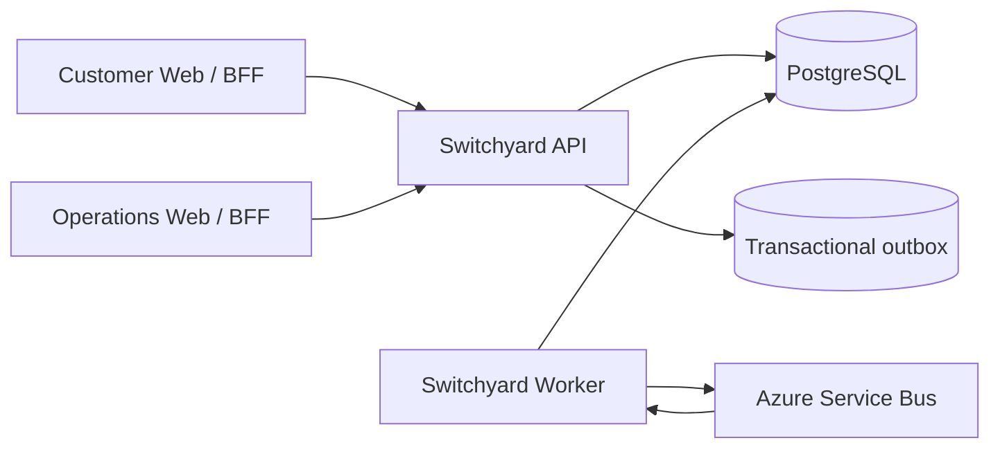

# Architecture Overview

Switchyard is designed around explicit business ownership and evolutionary deployment.

A bounded context is not automatically a microservice. The initial codebase stays in one monorepo while architecture tests and explicit contracts preserve context boundaries.

## Target runtime

The Worker and broker enter implementation when asynchronous workflows are introduced. They are not empty v0.1 projects.

## Core engineering rules

- Strong consistency stays inside one context transaction.
- Cross-context workflows are eventually consistent.
- No distributed two-phase transaction.
- Durable outbox and inbox/idempotency protect asynchronous boundaries.
- Order placement is orchestrated by Ordering.
- Inventory is reserved before payment authorisation.
- Payment authorisation and capture are separate.
- Payment/provider uncertainty is reconciled rather than guessed.
- Business timeline and technical telemetry remain separate.
- Security and authorization are server-side concerns.

See the ADR index for the ratified decisions.
