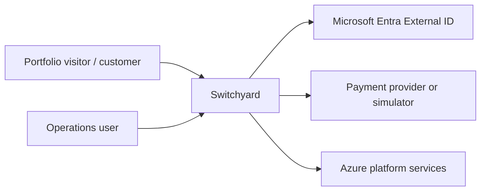

# System Context

## External trust boundaries

- Customer and operations browser sessions are separate.
- Credentials are delegated to Microsoft Entra External ID.
- Provider financial outcomes are verified server-side.
- Public DemoSession access is capability-limited and does not become operations access.
- PostgreSQL is private-network only in the intended Azure deployment.
- Azure Service Bus Standard uses TLS and Entra RBAC with least privilege.
